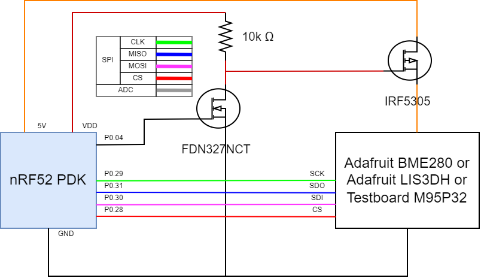

# Waketime Verification with Zephyr

This project trys to verifie the wake-up times of certain periferals using zephyr rtos.

## Components used

The components used in this porject were:
- nRF52 PDK
- BME280 (Adafruit)
- LIS3DH (Adafruit)
- FDN327NCT-ND (mosfet)
- IRF5305 (mosfet)

The diagram:

